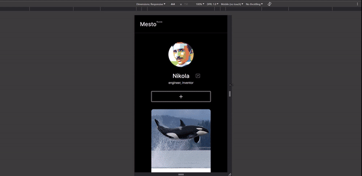

# "Mesto"

Mesto - это небольшой фото-сервис для размещения карточек с описанием и картинкой. Понравившейся картинке можно поставить лайк, а счетчик расположенный рядом, покажет общее количество лайков. Загруженные картинку возможно просматривать в полном размере, для этого необходимо нажать на карточку с фото. Удаление чужих карточек невозможно. Для подтверждения удаления реализовано модальное окно. Присутствует возможность смены аватарки и редактирования профиля пользователя. Поля форм валидируются на корректность введенных данных, а кнопка действия заблокированы если данные введены некорректно. Закрытие модальных окон реализовано тремя способами: нажатием на крестик, нажатием мыши на оверлей и клавишей esc. Кроме всего прочего, приложение имеет отзывчивую верстку, что позволяет удобно использовать приложение как на мобильных устройствах, так и на настольном компьютере.

## О технологиях:

В проекте используется семантическая разметка на HTML, CSS, логика написана на JavaScript. В этом проекте я впервые применял методологию объектно-ориентированного программирования (классы), что на практике мне помогло разобраться в принципах данной методологии. Кроме всего прочего, приложение имеет отзывчивую верстку, что позволяет удобно использовать приложение как на мобильных устройствах, так и на настольном компьютере. Для сборки проекта использован webpack и babel.

- CSS Grid;
- Flexbox;
- Webpack;
- ООП.

## Как запустить:

Запустить на [GitHub Pages](https://s-ig0r.github.io/mesto/)

 

Либо:

- клонировать репозиторий к себе на компьютер;
- открыть проект в среде разработки;
- в терминале ввести npm ci;
- после установки пакетов запустить командой в терминале npm run dev.

## Макет

-  [Ссылка](https://www.figma.com/file/2cn9N9jSkmxD84oJik7xL7/JavaScript.-Sprint-4?node-id=0%3A1).
